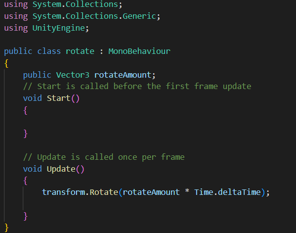

# Repositorio Realidade Aumentada com Unity

Aplicação realizada para estudo da Realidade Aumentada utilizando Unity + Vuforia.

Script utilizado para realizar a rotação do bloco 3D:

    

Lembrando que também é necessário realizar a configuração do Eixo em que o Script irá ser executado:

    

