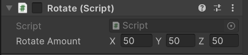

# Repositorio de Realidade Aumentada com Unity

Aplicação realizada para estudo da Realidade Aumentada utilizando Unity + Vuforia.

Abaixo é apresentado dois gif's exemplificando o que foi implementado no projeto e após isso é explicado o processo para você também poder criar na sua máquina local: 

<p align="center">
    
    
</p>

 ....

O Script utilizado para realizar a rotação do cubo 3D, foi codificado em C#:
 
```javascript
using System.Collections;
using System.Collections.Generic;
using UnityEngine;

public class rotate : MonoBehaviour
{
    public Vector3 rotateAmount;
    void Start() {
        
    }

    void Update() {
        transform.Rotate(rotateAmount * Time.deltaTime);        
    }
}
```

Lembrando que também é necessário realizar a configuração do Eixo em que o Script irá ser executado:

<p align="center">
    
</p>