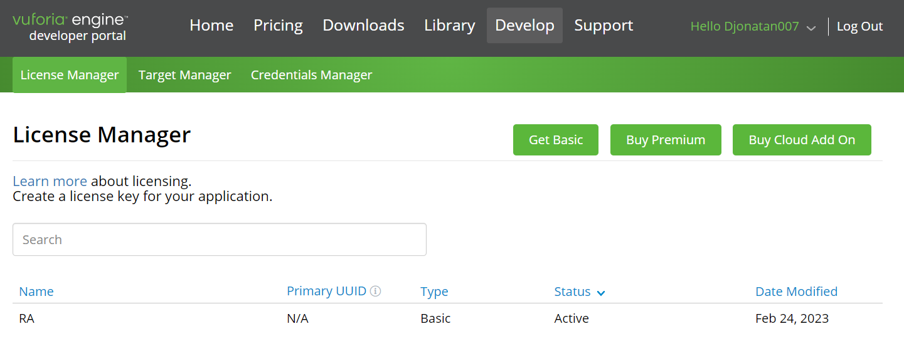
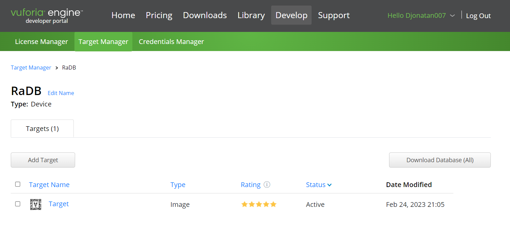
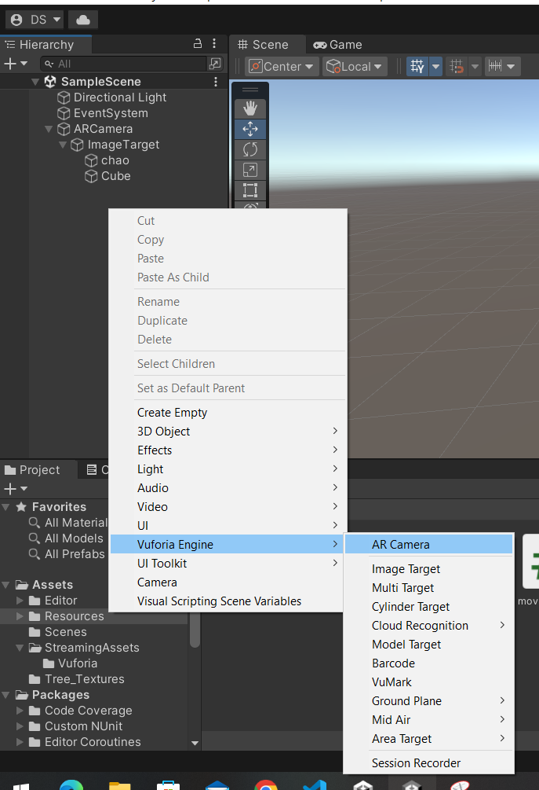
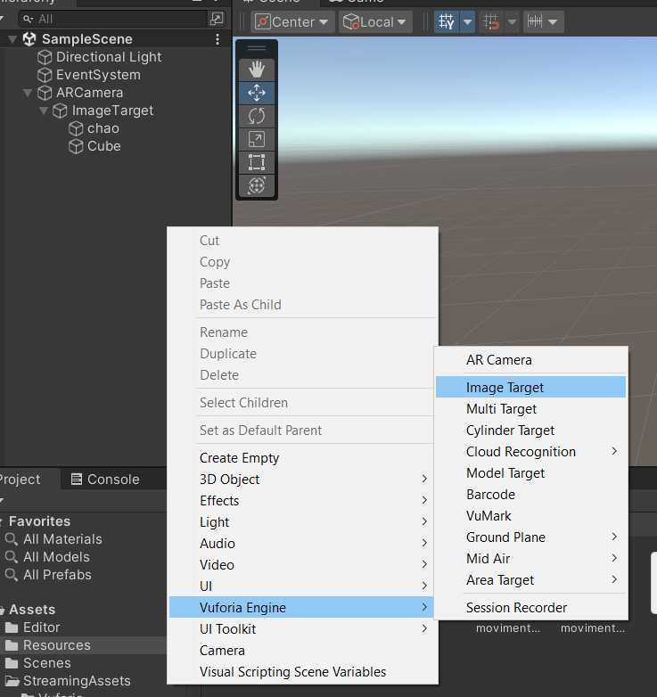
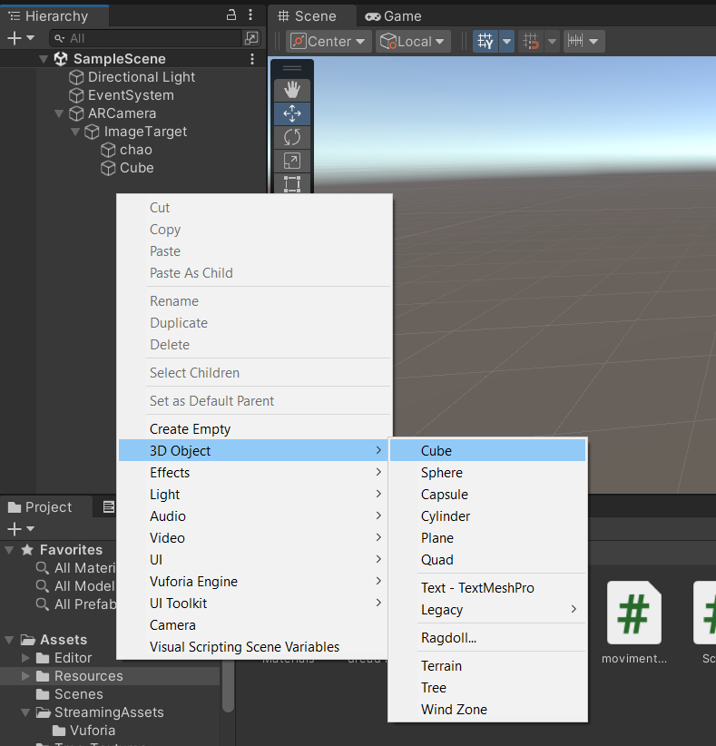
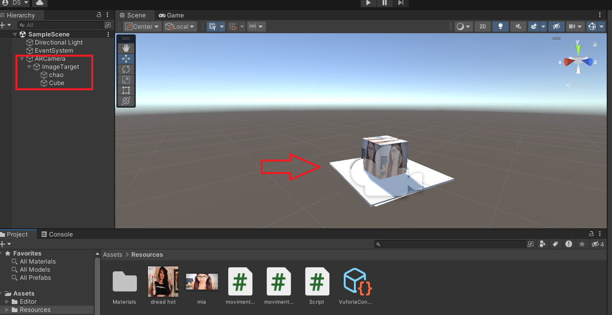

# Repositorio de Realidade Aumentada com Unity

Aplicação realizada para estudo da Realidade Aumentada utilizando Unity + Vuforia.

Abaixo é apresentado dois gif's exemplificando o que foi implementado no projeto e após isso é explicado o processo para você também poder criar na sua máquina local: 

<p align="center">
    
    
</p>


Para fazer uma aplicação como esta mostrada acima, realizaremos um passo a passo que será divididos em 3 partes.

Primeira parte:

1° passo - Realizar o download do Vuforia Engine:
<p dir="auto">
    <a href="https://developer.vuforia.com/user/login?url=/downloads/sdk%3F_%3D1678117884" rel="nofollow">Download Vuforia</a>
</p>

2° passo - Criar uma conta e uma licença para registrar o seu Target (alvo) dentro do site do Vuforia, como é mostrdo a baixo:
<p align="center">
    
</p>

3° passo - Para armazenar nossa imagem alvo, é necessário um banco de dados, que também é criado dentro do site:
<p align="center">
    
</p>

4° passo - Inclua a imagem alvo dentro do banco de dados, abaixo é exibido a imagem e também o mapeamento que é feito com a Realidade aumentada:
<p align="center">
    
    
</p>

5° passo - Faça o Download do seus banco de dados para importar no Unity. (também localizado na imagem do 3° passo com a descrição "Download Dabase (all))


Segunda parte:

1° passo - Abra o Unity e crie um novo projeto, dentro desse projeto é necessário criar dois componente do Voforia Engine: AR Câmera e Image Target, como é mostrado abaixo:

<p align="center">
    
    
</p>

2° passo - Crie dois objetos em formato de cubo, um para o posicionamento da imagem escolhida para apresentar dentro do bloco, e o outro bloco para utilizar de chão:

<p align="center">    
    
</p>

3° passo - Centralize o bloco que foi criado para alocar a imagem acima do chão, também vale lembrar que para funcionar o modo perspectiva é necessário que todos os objetos estejam dentro da Ar Câmera e dentro da imagem target, como mostrado abaixo:
<p align="center">    
    
</p>


Terceira parte:

1° passo - Criação do Script utilizado para realizar a rotação do cubo 3D. Todos os códigos foram desenvolvidos na linguagem C# (C-Sharp):
 
```javascript
using System.Collections;
using System.Collections.Generic;
using UnityEngine;

public class rotate : MonoBehaviour
{
    public Vector3 rotateAmount;
    void Start() {}

    void Update() {
        transform.Rotate(rotateAmount * Time.deltaTime);        
    }
}
```

Para que o cubo rode, é necessário realizar a configuração do Eixo no cubo em que o Script irá ser executado:

<p align="center">
    
</p>

2° passo - Criação do Script utilizado para realizar a movimentação e pulo do cubo utilizando as setas do teclado:

```javascript
using System.Collections;
using System.Collections.Generic;
using UnityEngine;

public class movimento : MonoBehaviour
{
    void Start(){}

    void Update()
    {
        if (Input.GetKey(KeyCode.LeftArrow)) {
        transform.Translate(0.01f, 0f, 0f);
        } 
        
        if (Input.GetKey(KeyCode.RightArrow)) {
            transform.Translate(-0.01f, 0f, 0f);
        } 

        if (Input.GetKey(KeyCode.DownArrow)) {
            transform.Translate(0f, 0f, 0.01f);
        }
        
        if (Input.GetKey(KeyCode.UpArrow)) {
            transform.Translate(0f, 0f, -0.01f);
        }

        if (Input.GetKey(KeyCode.Space)) {
            transform.Translate(0f, 0.01f, 0f);
        }              
    }
}
```

Agora basta colocar os scripts dentro do cubo e se divertir :)